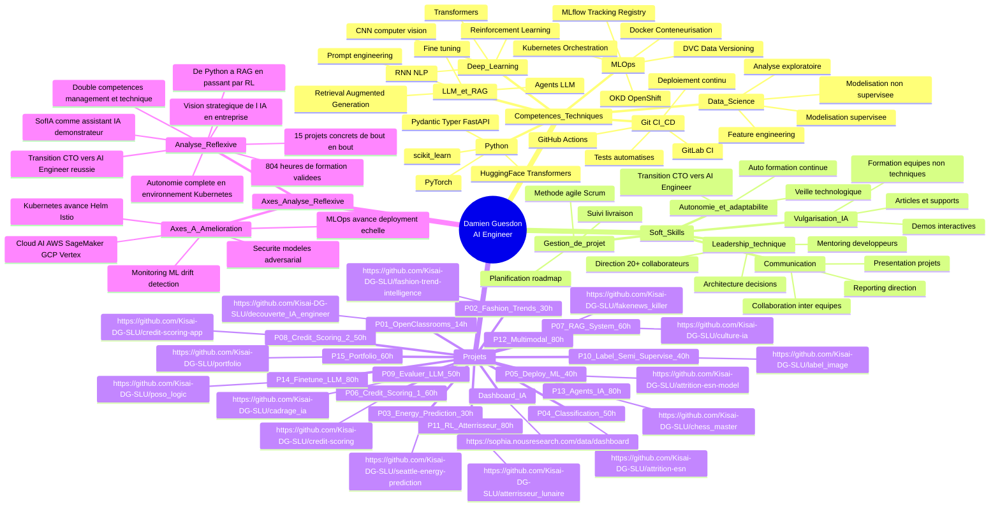

# Carte Mentale

```mermaid
mindmap
  root((Damien Guesdon<br/>AI Engineer))
    Competences_Techniques
      Python
        PyTorch
        scikit_learn
        HuggingFace Transformers
        Pydantic Typer FastAPI
      MLOps
        MLflow Tracking Registry
        DVC Data Versioning
        Docker Conteneurisation
        Kubernetes Orchestration
        OKD OpenShift
      Git CI_CD
        GitHub Actions
        GitLab CI
        Tests automatises
        Deploiement continu
      LLM_et_RAG
        Retrieval Augmented Generation
        Fine tuning
        Prompt engineering
        Agents LLM
      Deep_Learning
        CNN computer vision
        RNN NLP
        Transformers
        Reinforcement Learning
      Data_Science
        Analyse exploratoire
        Modelisation supervisee
        Modelisation non supervisee
        Feature engineering
    Soft_Skills
      Gestion_de_projet
        Planification roadmap
        Suivi livraison
        Methode agile Scrum
      Vulgarisation_IA
        Formation equipes non techniques
        Articles et supports
        Demos interactives
      Leadership_technique
        Direction 20+ collaborateurs
        Architecture decisions
        Mentoring developpeurs
      Autonomie_et_adaptabilite
        Auto formation continue
        Veille technologique
        Transition CTO vers AI Engineer
      Communication
        Reporting direction
        Collaboration inter equipes
        Presentation projets
    Projets
      P01_OpenClassrooms_14h
        https://github.com/Kisai-DG-SLU/decouverte_IA_engineer
      P02_Fashion_Trends_30h
        https://github.com/Kisai-DG-SLU/fashion-trend-intelligence
      P03_Energy_Prediction_30h
        https://github.com/Kisai-DG-SLU/seattle-energy-prediction
      P04_Classification_50h
        https://github.com/Kisai-DG-SLU/attrition-esn
      P05_Deploy_ML_40h
        https://github.com/Kisai-DG-SLU/attrition-esn-model
      P06_Credit_Scoring_1_60h
        https://github.com/Kisai-DG-SLU/credit-scoring
      P07_RAG_System_60h
        https://github.com/Kisai-DG-SLU/culture-ia
      P08_Credit_Scoring_2_50h
        https://github.com/Kisai-DG-SLU/credit-scoring-app
      P09_Evaluer_LLM_50h
        https://github.com/Kisai-DG-SLU/cadrage_ia
      P10_Label_Semi_Supervise_40h
        https://github.com/Kisai-DG-SLU/label_image
      P11_RL_Atterrisseur_80h
        https://github.com/Kisai-DG-SLU/atterrisseur_lunaire
      P12_Multimodal_80h
        https://github.com/Kisai-DG-SLU/fakenews_killer
      P13_Agents_IA_80h
        https://github.com/Kisai-DG-SLU/chess_master
      P14_Finetune_LLM_80h
        https://github.com/Kisai-DG-SLU/poso_logic
      P15_Portfolio_60h
        https://github.com/Kisai-DG-SLU/portfolio
      Dashboard_IA
        https://sophia.nousresearch.com/data/dashboard
    Axes_Analyse_Reflexive
      Axes_A_Amelioration
        MLOps avance deployment echelle
        Cloud AI AWS SageMaker GCP Vertex
        Monitoring ML drift detection
        Securite modeles adversarial
        Kubernetes avance Helm Istio
      Analyse_Reflexive
        Transition CTO vers AI Engineer reussie
        804 heures de formation validees
        15 projets concrets de bout en bout
        De Python a RAG en passant par RL
        Autonomie complete en environnement Kubernetes
        SofIA comme assistant IA demonstrateur
        Double competences management et technique
        Vision strategique de l IA en entreprise
```
