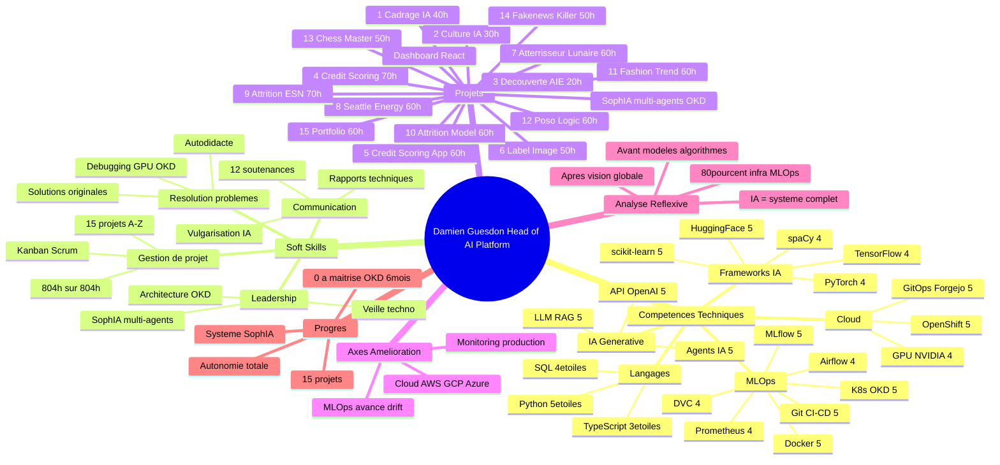

```mermaid
mindmap
  root((Damien Guesdon Head of AI Platform))
    Competences Techniques
      Langages
        Python 5etoiles
        SQL 4etoiles
        TypeScript 3etoiles
      Frameworks IA
        PyTorch 4
        TensorFlow 4
        scikit-learn 5
        HuggingFace 5
        spaCy 4
      MLOps
        MLflow 5
        DVC 4
        Airflow 4
        Docker 5
        K8s OKD 5
        Git CI-CD 5
        Prometheus 4
      IA Generative
        LLM RAG 5
        Agents IA 5
        API OpenAI 5
      Cloud
        GPU NVIDIA 4
        OpenShift 5
        GitOps Forgejo 5
    Soft Skills
      Gestion de projet
        15 projets A-Z
        Kanban Scrum
        804h sur 804h
      Communication
        Rapports techniques
        12 soutenances
        Vulgarisation IA
      Leadership
        SophIA multi-agents
        Architecture OKD
        Veille techno
      Resolution problemes
        Solutions originales
        Debugging GPU OKD
        Autodidacte
    Projets
      1 Cadrage IA 40h
      2 Culture IA 30h
      3 Decouverte AIE 20h
      4 Credit Scoring 70h
      5 Credit Scoring App 60h
      6 Label Image 50h
      7 Atterrisseur Lunaire 60h
      8 Seattle Energy 60h
      9 Attrition ESN 70h
      10 Attrition Model 60h
      11 Fashion Trend 60h
      12 Poso Logic 60h
      13 Chess Master 50h
      14 Fakenews Killer 50h
      15 Portfolio 60h
      SophIA multi-agents OKD
      Dashboard React
    Axes Amelioration
      MLOps avance drift
      Cloud AWS GCP Azure
      Monitoring production
    Analyse Reflexive
      Avant modeles algorithmes
      Apres vision globale
      80pourcent infra MLOps
      IA = systeme complet
    Progres
      0 a maitrise OKD 6mois
      Systeme SophIA
      15 projets
      Autonomie totale
```
